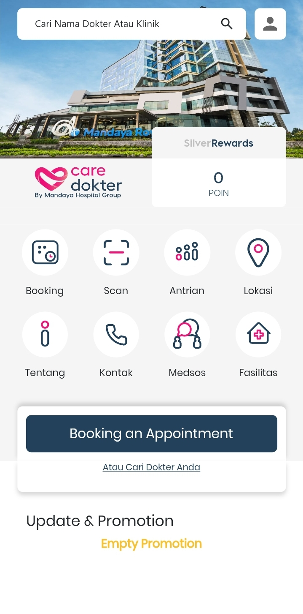
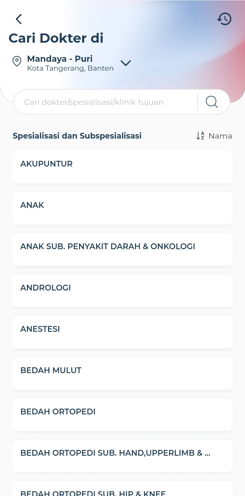
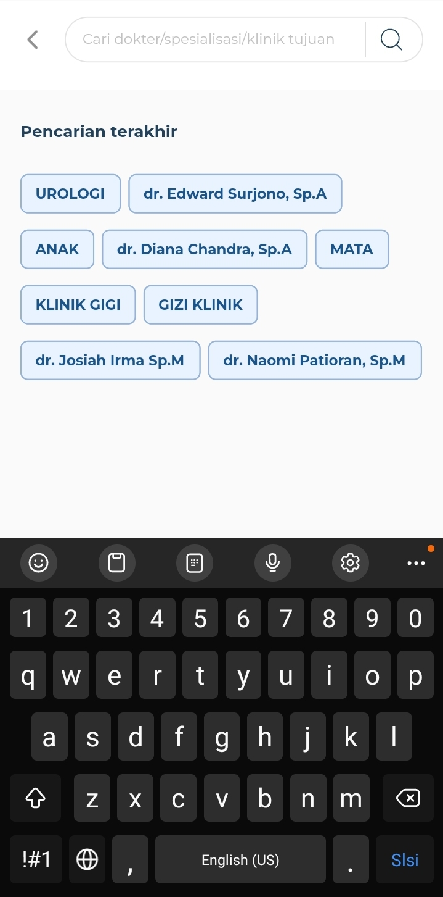
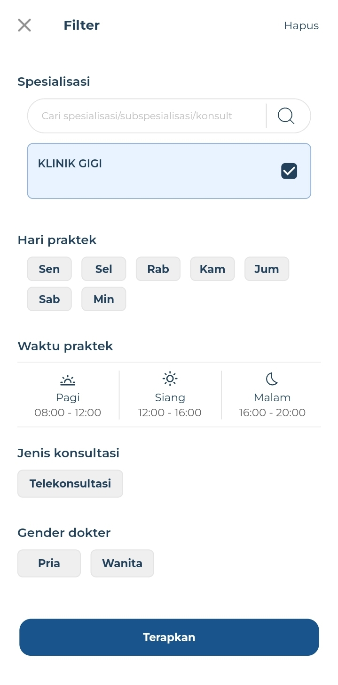
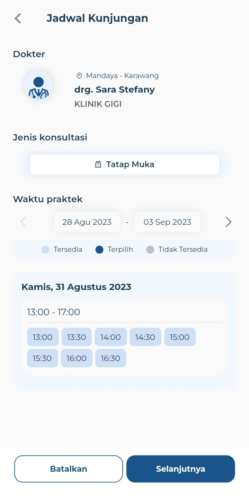
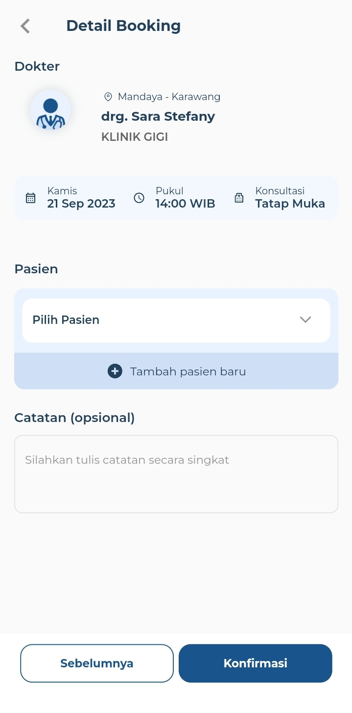
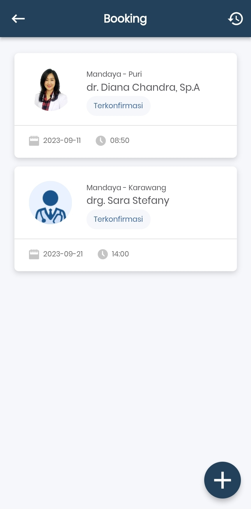
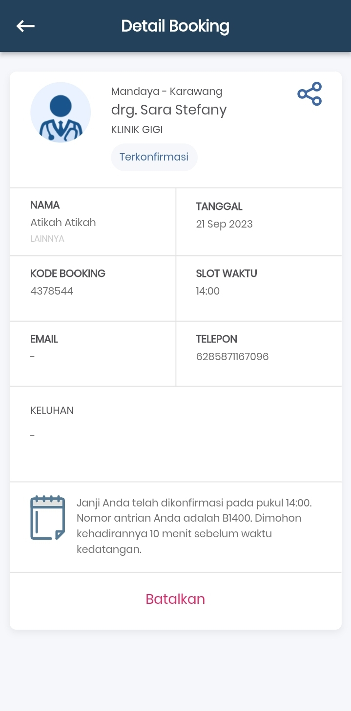
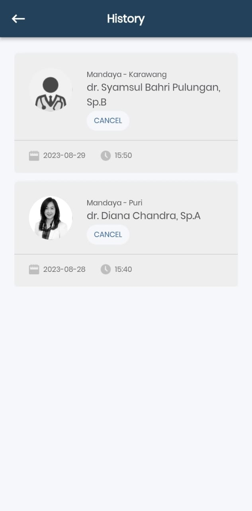

# Care Doctor Application API Documentation

Welcome to the API documentation for the Care Doctor Application. This guide outlines the API endpoints that use the HTTP GET method for making reservations.

## Authentication

All endpoints in this API require bearer authentication. 

```plaintext
Authorization: Bearer YOUR_ACCESS_TOKEN
```
## Endpoints

### 1. Get Total Points

- 
- Endpoint: `/users/points`
- Method: GET
- Description: Get the total points of the user's account.

### 2. Get List of Hospitals, Specializations, and Sub Specializations

- 
- Endpoint: `/hospitals`
- Method: GET
- Description: Get the list of hospitals.


***

- Endpoint: `/hospitals/{hospitalId}/specializations`
- Method: GET
- Description: Get the list of specializations and sub specialization names based on the current hospital id.

### 3. Search for Doctors

- 
- Endpoint: `/hospitals/{hospitalId}/doctors`
- Method: GET
- Query Parameters:
  - `search`: Search query property for doctor name, specialization name, or sub specialization name.
- Description: Get a list of doctors based on the search criteria.


### 4. Filter Doctors

- 
- Endpoint: `/hospitals/{hospitalId}/doctors/filter`
- Method: GET
- Query Parameters:
  - `specialization`: Specialization name
  - `day`: Practice day
  - `start_time`: Practice start time in the format "HH:mm"
  - `end_time`: Practice end time in the format "HH:mm"
  - `type`: Booking type
  - `gender`: Doctor's gender
- Description: Get a list of doctors based on various filter criteria.

### 5. Get Doctor's Practice Schedules

- 
- Endpoint: `/hospitals/{hospitalId}/doctors/{doctorId}/schedules`
- Method: GET
- Query Parameters:
  - `start_date`: Start date in the format "YYYY-MM-DD"
  - `end_date`: End date in the format "YYYY-MM-DD"
- Description: Get the list of a doctor's schedules within a specified date range.

### 6. Get Family Member Names

- 
- Endpoint: `/users/family-members`
- Method: GET
- Description: Get a list of family member names to be used as a patient when making a reservation.

### 7. Get Bookings

- 
- Endpoint: `/bookings`
- Method: GET
- Description: Get a list of the user's bookings that are currently in progress.

### 8. Get Detailed Booking Information

- 
- Endpoint: `/bookings/{booking_id}`
- Method: GET
- Description: Get detailed information about a specific booking ID.

### 9. Get Booking History

- Endpoint: `/bookings/histories`
- Method: GET
- Description: Get a list of booking histories for a specific user.
- 
